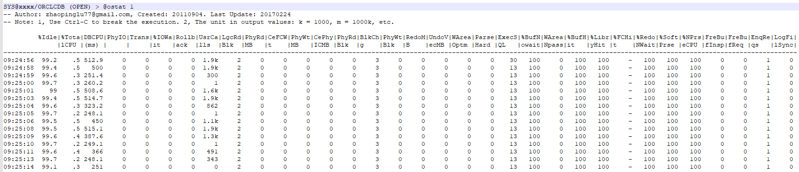

# Ostat
Oracle Database Real Time Performance Monitoring Tool.

\<WIP\>

Example:



# **1. Installation**
Use sqlplus to connection to a database with sys user. Then run 
@ostat/pipe_ostat

Done.


# **2. Run ostat script to get the 'almost real time' performance metrics output.**
The followings are some quick examples.


## **Example 1: Query CPU usage with script ostat_cpu.sql**

```
SYS@XXX/ORCLCDB (OPEN) > @ostat_cpu 1
-- Author: zhaopinglu77@gmail.com, Created: 20110904. Last Update: 20170224
-- Note: 1, Use Ctrl-C to break the execution. 2, The unit in output values: k = 1000, m = 1000k, etc.

         LOAD        |VM_IN_BYTES |VM_OUT_BYTES|%Idle       |%User       |%Sys        |%WIO        |%TotalCPU   |%BusyCPU    |
------------------------------------------------------------------------------------------------------------------------------
02:47:41           .3            0            0         98.7          1.3            0            0          1.3         98.9
02:47:43           .3            0            0         98.7          1.3            0            0          1.3         98.3
02:47:45           .3            0            0         98.7          1.3            0            0          1.3         95.1
02:47:47           .3            0            0         98.7          1.3            0            0          1.3         98.4
02:47:49           .3            0            0         98.3          1.4           .3            0          1.3         73.6
02:47:51           .4            0            0         98.3          1.5           .2            0          1.3         73.9
02:47:53           .4            0            0         98.7          1.3            0            0          1.3         96.9
02:47:55           .4            0            0         98.7          1.3            0            0          1.3         97.4
02:47:57           .4            0            0         98.7          1.3            0            0          1.3         92.9
02:47:59           .4            0            0         98.5          1.3           .2            0          2.1        144.5
02:48:01           .4            0            0         99.9            0            0            0            0         14.5
02:48:03           .4            0            0          100            0            0            0            0         17.6
02:48:05           .4            0            0          100            0            0            0            0         34.6
```


## **Example 2: Check the db level stats with ostat.sql**

### In session 1, run below PL/SQL code. 
```
SYS@XXX/ORCLPDB1 (OPEN) > begin
  2  for i in 1..100000 loop
  3  execute immediate 'select count(*) from dual where rownum<'||i;
  4  end loop;
  5  end;
  6  /
```

Note: The sql inside PL/SQL code didn't use bind variable. What's gonna happen to database? 


### In session 2, run ostat script to monitor db stats.

```
SYS@XXX/ORCLCDB (OPEN) > @ostat 1

-- Author: zhaopinglu77@gmail.com, Created: 20110904. Last Update: 20170224
-- Note: 1, Use Ctrl-C to break the execution. 2, The unit in output values: k = 1000, m = 1000k, etc.
         %Idle|%Tota|DBCPU|PhyIO|Trans|%IOWa|Rollb|UsrCa|LgcRd|PhyRd|CeFCW|PhyWt|CePhy|PhyRd|BlkCh|PhyWt|RedoM|UndoV|WArea|Parse|ExecS|%BufN|WArea|%BufH|%Libr|%FCHi|%Redo|%Soft|%NPrs|FreBu|FreBu|EnqRe|LogFi|
              |lCPU |(ms) |     |     |it   |ack  |lls  |Blk  |MB   |t    |MB   |ICMB |Blk  |g    |Blk  |B    |ecMB |Optm |Hard |QL   |owait|Npass|it   |yHit |t    |NWait|Prse |eCPU |fInsp|fReq |qs   |lSync|
---------------------------------------------------------------------------------------------------------------------------------------------------------------------------------------------------------------
03:01:13  98.4   2.3  2.3k     0     0     0     0     1     2     0     0     0     0     0     3     0     0     0     0     0    13   100     0   100   100     -   100   100   100     0     0     1     0
03:01:14  98.5     0     0     0     0     0     0     0     2     0     0     0     0     0     3     0     0     0     0     0    13   100     0   100   100     -   100   100     -     0     0     1     0
03:01:16  98.5   2.5  2.5k     0     0     0     0     1     2     0     0     0     0     0     3     0     0     0     0     0    13   100     0   100   100     -   100   100   100     0     0     1     0
03:01:17  98.1    .3 253.2     0     0     0     0     2     2     0     0     0     0     0     3     0     0     0     0   406   419   100     0   100    35     -   100   3.1 -38.2     0     0   167     0
03:01:18  97.1   3.7  3.7k     0     0     0     0     1     2     0     0     0     0     0     3     0     0     0     0  1.4k  1.5k   100     0   100  33.8     -   100    .8  66.1     0     0  1.4k     0
03:01:19  97.2     2    2k     0     0     0     0     0     2     0     0     0     0     0     3     0     0     0     0  1.4k  1.5k   100     0   100  33.8     -   100    .9  37.6     0     0  1.4k     0
03:01:21  97.2   2.5  2.5k     0     0     0     0     1     2     0     0     0     0     0     3     0     0     0     0  1.4k  1.5k   100     0   100  33.8     -   100     1  49.3     0     0  1.4k     0
03:01:22  97.2   2.3  2.3k     0     0     0     0     0     2     0     0     0     0     0     3     0     0     0     0  1.4k  1.5k   100     0   100  33.8     -   100    .8  49.5     0     0  1.4k     0
```

As we can see from above output. The literal sql caused some changes:
1) The hard parses number increased from 0 to 1.4k/s
2) The library cache hit ratio dropped from 100% to 33.8%
3) The dbcpu(ms) also increased.


## **Example 3: Monitor db network traffic stats with ostat_net.sql**

### In session 1, run below sql to fetch a large amount of data
```
set autot trace   -- optional, to suppress the screen output
select text from dba_views;
```

### In session 2, run ostat_net.sql
```
SYS@XXX/ORCLCDB (OPEN) > @ostat_net 1
-- Author: zhaopinglu77@gmail.com, Created: 20110904. Last Update: 20170224
-- Note: 1, Use Ctrl-C to break the execution. 2, The unit in output values: k = 1000, m = 1000k, etc.

         ToCln     |FromCln   |RndTripTo/|ToDBL     |FromDBL   |RndTripTo/|VecToCln  |VecFromCln|VecToDBL  |VecFromDBL|FromCln/RT|ToCln/RT  |
                   |          |FromCln   |          |          |FromDBL   |          |          |          |          |          |          |
---------------------------------------------------------------------------------------------------------------------------------------------
03:47:51          1          0          0          0          0          0          0          0          0          0          -          -
03:47:52      43.2k       1.2k         19          0          0          0          0          0          0          0       61.5       2.3k
03:47:54       262k      11.7k       1.1k          0          0          0          0          0          0          0         11      245.5
03:47:55       282k      16.1k       1.5k          0          0          0          0          0          0          0         11      192.1
03:47:56       221k      12.7k       1.2k          0          0          0          0          0          0          0         11      192.2
03:47:57       257k      14.7k       1.3k          0          0          0          0          0          0          0         11      192.1
03:47:59       283k      16.2k       1.5k          0          0          0          0          0          0          0         11      192.1
03:48:00       163k      11.5k        836          0          0          0          0          0          0          0       13.7      194.5
03:48:01          1          0          0          0          0          0          0          0          0          0          -          -
```

\<TBD\>
